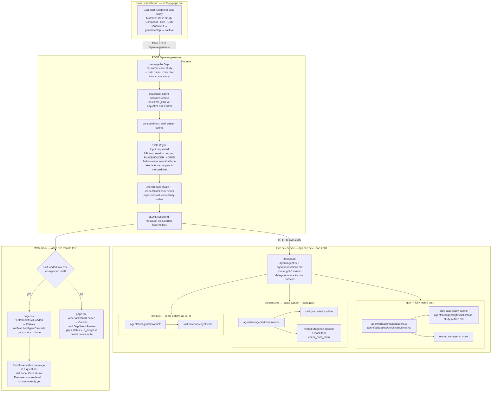
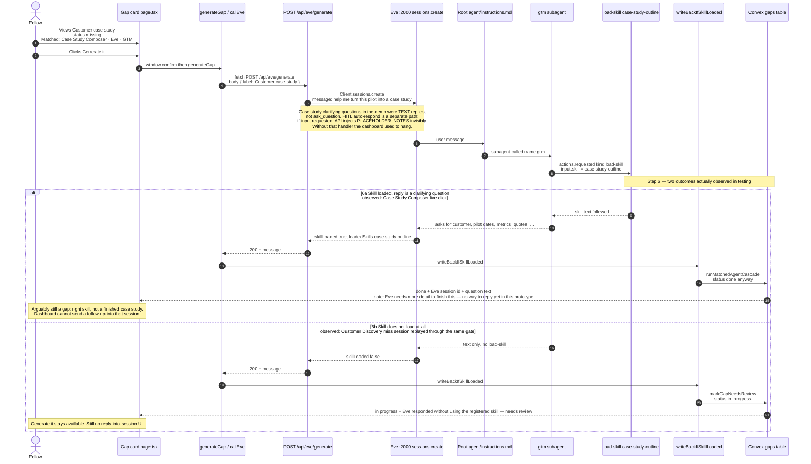

# Eve integration — architecture and demo flow

Grounded in the code and traces in this repo. Do not treat every “asks for more input” card as `ask_question`: **most dashboard clarifying questions this week were ordinary assistant text**, not a HITL tool call.

---

## Demo note — PLACEHOLDER_NOTES auto-respond (real risk)

**Has this path fired in a normal dashboard click this week? No.** Case Study / Pitch / Discovery “please provide X” replies were the skill’s **text**. The one real `input.requested` earlier (`wrun_01M056VZ8WEJJEA4ZTR779Q7BB`) happened **before** auto-respond existed, so the click hung.

**Forced test (this check):** product instructions were temporarily told to use the human-input tool. Session `wrun_01M05D82DXQDTVRK0EG383PV4J` emitted `input.requested`. The same logic as `src/app/api/eve/generate/route.ts` then called `session.respond` with `PLACEHOLDER_NOTES`.

**What the Fellow would have seen** (final assistant text, abbreviated):

> I routed this to the **product** harness… the notes you provided appear to be **only a brief summary**… For now, I can only safely synthesize what’s in the recap: an Ops-led logistics persona… **4 hours/week**… **missed SLAs**… **Slack + Excel**… **30-day pilot pricing**… Paste the actual notes and I’ll redo the synthesis.

Direct answers:

| Question | Answer from that session |
|---|---|
| Finished deliverable? | **No.** It still asked for raw transcripts. It also recited the fake recap as if it were real-ish evidence. |
| Is the string `PLACEHOLDER_NOTES` / “Placeholder interview notes for dashboard generate” visible? | **No.** That label never appeared on the card. |
| Could Convex go `done` on fake data with no flag? | **Yes, if `load-skill` also fired.** The safeguard only checks skill load, not “is this placeholder.” This test did **not** load `interview-synthesis` (`skillsTurn2: []`), so write-back would have been `in_progress` / needs review — but the **message still contained the fake facts**. If a later HITL turn also loads the skill, the gap can be `done` with invented logistics-ops numbers and nothing saying they were injected by the API. |

Customer Discovery’s current `messageForGap` **already pastes those notes into the first user message**, so a dashboard CD click can bake the same fake facts in **without** HITL. HITL auto-respond is a second, quieter injection path for any gap that calls `ask_question`.

---

## Diagram 1 — Eve architecture (GTM as the worked example)

GTM has **no nested subagents**. Only Investments has a nested `diligence-checker`. Product repeats the same one-skill pattern as GTM (`interview-synthesis`).

**File map (GTM vs the other two)**

| Harness | Agent files | Skill | Nested subagents |
|---|---|---|---|
| `gtm` | `agent/subagents/gtm/agent.ts`, `instructions.md` | `case-study-outline.md` | **none** |
| `product` | `agent/subagents/product/agent.ts`, `instructions.md` | `interview-synthesis.md` | none |
| `investments` | `agent/subagents/investments/agent.ts`, `instructions.md` | `pitch-deck-outline.md` | `subagents/diligence-checker/` + `tools/check_data_room.ts` |

---

## Diagram 2 — Demo sequence (Customer case study)

This is the path we actually ran. Step 6 is **the two outcomes observed in testing**, not an ideal happy path.

**What the safeguard does and does not do**

- It **does** block `done` when the expected skill never appears on the Eve stream (`case-study-outline` / `pitch-deck-outline` / `interview-synthesis`).
- It **does not** require a finished deliverable. A loaded skill that only asks for more input still goes through `runMatchedAgentCascade` → `done`.
- The dashboard stores Eve text in React state (`eveResults`), not a Convex content field. Reload loses the message; Convex only keeps status / `lastUpdatedBy`.
- There is no `session.send` from the UI after the first turn.
- **PLACEHOLDER_NOTES auto-respond** is not how Case Study Composer asked for inputs in the demo. It is live code on every `/api/eve/generate` call. If Eve emits `input.requested`, fake interview bullets are answered on the Fellow’s behalf. The card can show those facts without the word “placeholder.” If the expected skill also loaded, Convex still goes `done`.
